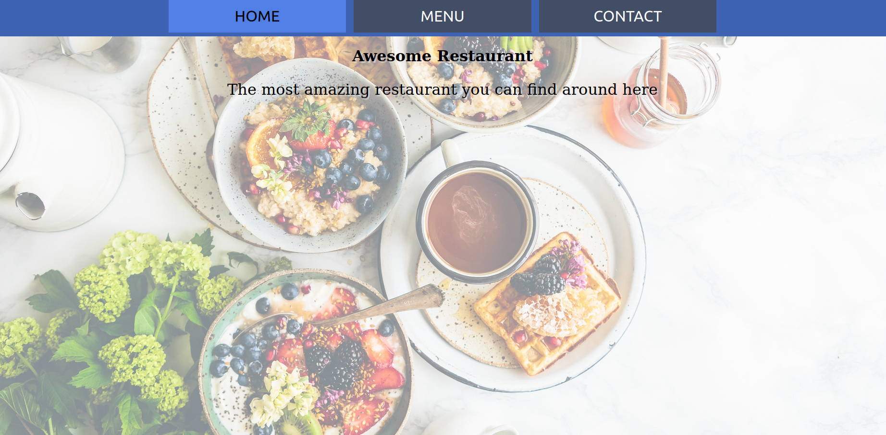

# Restaurant App

> A simple multi-tab app using DOM manipulation.



## Built With

- HTML/CSS
- Javascript
- webpack

## Live Demo

[Live Demo Link](https://mohamedsabry0.github.io/restaurant-app/)


## Getting Started

To get a local copy up and running follow these simple example steps.

### Prerequisites

- A web browser

### Setup

- Clone or download the project to your local machine

- Change to the project's root directory

- run `npm install`

- run `npm run start`

- Open the index file with your browser
```javascript
index.html
```

## Author

👩‍💻 **Mohamed Sabry**

- GitHub: [@mohamedSabry0](https://github.com/mohamedSabry0)
- Twitter: [@mohsmh0](https://twitter.com/mohsmh0)
- LinkedIn: [Mohamed Sabry](https://linkedin.com/in/mohamed-sabry0/)

## 🤝 Contributing

Contributions, issues, and feature requests are welcome!

Feel free to check the [issues page](issues/).

## Show your support

Give a ⭐️ if you like this project!
